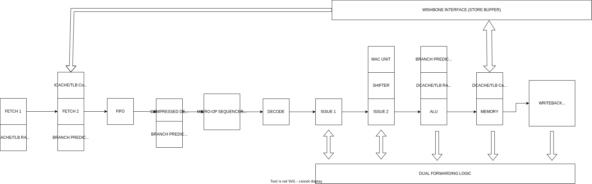

**&copy; 2016-2022 Revanth Kamaraj (krevanth) \<revanth91kamaraj@gmail.com\>**

LinkedIn: www.linkedin.com/in/revanth-kamaraj-178662113

         krevanth ~ git version 2.36.1
         -----------------------------
         Project   : ZAP
         Author(s) : 462  Revanth Kamaraj(krevanth)   <revanth91kamaraj@gmail.com>
                       1  Erez Binyamin(ErezBinyamin) <ezbn2532@gmail.com>

         Repo      : https://github.com/krevanth/ZAP.git
         License   : GPL-2.0-only

         COPYRIGHT (C) 2016-2022 REVANTH KAMARAJ(KREVANTH)
         
         THIS PROGRAM IS FREE SOFTWARE; YOU CAN REDISTRIBUTE IT AND/OR MODIFY
         IT UNDER THE TERMS OF THE GNU GENERAL PUBLIC LICENSE AS PUBLISHED BY
         THE FREE SOFTWARE FOUNDATION; EITHER VERSION 2 OF THE LICENSE, OR
         (AT YOUR OPTION) ANY LATER VERSION.
        
         THIS PROGRAM IS DISTRIBUTED IN THE HOPE THAT IT WILL BE USEFUL,
         BUT WITHOUT ANY WARRANTY; WITHOUT EVEN THE IMPLIED WARRANTY OF
         MERCHANTABILITY OR FITNESS FOR A PARTICULAR PURPOSE.  SEE THE
         GNU GENERAL PUBLIC LICENSE FOR MORE DETAILS.
         
         YOU SHOULD HAVE RECEIVED A COPY OF THE GNU GENERAL PUBLIC LICENSE ALONG
         WITH THIS PROGRAM; IF NOT, WRITE TO THE FREE SOFTWARE FOUNDATION, INC.,
         51 FRANKLIN STREET, FIFTH FLOOR, BOSTON, MA 02110-1301 USA.
                                                
### HOW TO RUN

If your distro does not provide Verilator >= 4.x, you should use docker. Assuming you are part of docker group, simply do:

```bash
make -f docker.mk [TC=<test_name>]
```

If your distro does provide Verilator >= 4.x, you simply need to install the required packages on your system: verilator, 
gcc, arm-none-eabi-gcc, perl, gtkwave, gdb, openocd, make. Once installed, simply do:

```bash
make -f make.mk [TC=<test_name>]
```
The test name is simply the folder name in src/ts. If you omit specifying TC, all the tests will be run.

### 1. Contributors

Except where otherwise noted, the ZAP processor and its source code is Copyright Revanth Kamaraj(krevanth). The proper 
notices are in the head of each file. 

Credit to Bharat Mulagondla (bharathmulagondla) (https://github.com/bharathmulagondla) for finding bugs in TLB logic.

Credit to Erez Binyamin (https://https://github.com/ErezBinyamin/) for adding Docker images.

### 2. Introduction 

ZAP is a Verilog processor core that can execute ARM&reg;v5TE binaries. Note that ZAP is ***NOT*** an ARM clone. 
ZAP is a completely different implementation and unique superpipelined microarchitecture built from scratch with the 
aim of providing maximum performance for typical FPGA/ASIC targets. Cache and MMU should be enabled as soon as possible
to enable good performance.

ZAP can run binaries compiled for legacy ARM cores (ARMv5TE ISA) and provides full software compatibility including 
architecturally exposed CPU modes, short instruction support, FCSE, cache, MMU, TLBs and the CP15 interface layer for 
cache and MMU control. The software compatibility allows ZAP to boot full operating systems like Linux. 

 

### 3. Microarchitecture and Implementation 

#### 3.1. Superpipelined Microarchitecture 


 * Please note that the processor is *not* an ARM clone but a completely different RTL and unique microarchitecture design, microarchitected by me from scratch, in synthesizable SV.
 * Design is fully synchronous to rising edge of clock. Design is built around posedge driven flip-flops and memory blocks. Design uses a single clock.
 * Reset is synchronous to the rising edge of the clock (Sync Reset).
 * Deep 11-stage pipeline design to achieve high operating frequency. 
   * Stages: IAddressGenerator, Fetch/ICacheRead, InstrBuffer, CompressedDecode, PreDecode, Decode, Issue, Shift/Multiply, Execute/DAddressGenerator, DCacheRead, RegisterWriteback 
   * Pipeline has extensive bypass network that is optimized to resolve dependencies. This allows for maximum throughput. 
     * Pipeline has a unique dual feedback implementation to further optimize dependency resolution.
       * This permits instructions that use the shifter to ***not*** stall a subsequent dependent command if the subsequent dependent command command specifies zero shift (LSL #0). 
   * Most operations execute at a rate of 1 operation per clock.
   * The deep pipeline allows the processor to reach ~100MHz on a Spartan/Artix 7-Series FPGA.
   * Each multiplication/MAC operation takes 4 cycles to complete.
     * The pipeline stalls when a multiply/MAC operation is in progress. 
     * The result is available 1 cycle after the MAC operation completes. 
     * Having a dependent instruction right after the multiply/MAC will incur an additional cycle of stall.
   * CISC-style instructions are sequenced as simpler micro-ops for the internal RISC core.
   * A direct mapped bimodal branch predictor is used to improve performance to counter the longer pipeline.
   * Two write ports for the register file allow LDR/STR with writeback to execute as a single instruction. 
   * Register file is implemented using flip-flops.
 * Cache and MMU is supported and configurable through parameters.
   * Cache latency on read and write hit is 1 cycle. 
   * Basically, if a hit occurs, it will not insert any bubbles or stall the pipeline.
     * Note that data is available for instructions a cycle after the cache read. A dependent instruction right after will stall the pipeline for an additional cycle.
   * Note that a cache miss will (effectively) stall the entire pipeline.
   * Uses direct mapped split caches (VIVT) and direct mapped TLBs. Individual TLBs RAMs are provided for 1M/64K/4K/1K pages, whose size can be configured through Verilog paramters.
 * Provides Verilog parameters for configuration including cache and TLB parameters.
 * Design is microarchitected and implemented in synthesizable SV HDL.

#### 3.1.1. Clock and Reset

##### 3.1.1.1. Clock
 * The processor uses a synchronous single clock based design style.
 * All sequential elements are edge sensitive and are driven on the rising edge of clock.
   * All IO interfaces are also driven on the rising edge of the clock.

##### 3.1.1.2. Reset 
 * Reset should be: 
   * Synchronous to the rising edge of clock. 
   * Should be pulsed high for atleast 1 cycle of clock. 
   * Active high and should be asserted and deasserted on the rising edge of clock.
 * One cycle after reset deassertion:
   * Processor will start executing instructions from physical bus address 0x0. 
   * Processor will be in supervisory mode (SVC). 

### 4. Coprocessor 15 CSRs

Please refer to the arch spec for CP15 CSR requirements.

 * Register 1: Cache and MMU control.
 * Register 2: Translation Base.
 * Register 3: Domain Access Control.
 * Register 5: FSR.
 * Register 6: FAR.
 * Register 8: TLB functions.
 * Register 7: Cache functions.
   * The arch spec allows for a subset of the functions to be implemented for register 7. 
   * These are supported (Read as {opcode2, crm}) in ZAP for register 7:
     * CASE_FLUSH_ID_CACHE               = 7'b000_0111
     * CASE_FLUSH_I_CACHE                = 7'b000_0101
     * CASE_FLUSH_D_CACHE                = 7'b000_0110
     * CASE_CLEAN_ID_CACHE               = 7'b000_1011
     * CASE_CLEAN_D_CACHE                = 7'b000_1010
     * CASE_CLEAN_AND_FLUSH_ID_CACHE     = 7'b000_1111
     * CASE_CLEAN_AND_FLUSH_D_CACHE      = 7'b000_1110
 * Register 13: FCSE Register.

### 5. Usage

 * To use the ZAP processor in your project:
   * Add all the files *.v in src/rtl/ to your project.
   * Add src/rtl/ to your tools search path to allow it to pick up Verilog headers.
   * Instantiate the top level CPU module, zap_top, in your SOC.
     * The processor provides a Wishbone B3 bus. It is recommended that you use it in registered feedback cycle mode.
     * Interrupts should be routed from the appropriate VIC. Interrupts are level sensitive and should be synchronous to the CPU clock.
     * Wire up clock and reset as required.

### 5.1. Installation (GIT)

To get the files of the ZAP processor, please execute:

```bash
git clone https://github.com/krevanth/ZAP.git
```
#### 5.2. CPU Configuration (Verilog Parameters)

| Parameter                | Default| Description                                                                               |
|--------------------------|--------|-------------------------------------------------------------------------------------------|
| BP_ENTRIES               |  1024  | Branch Predictor Settings. Predictor RAM depth. Must be 2^n and > 2                       |
| FIFO_DEPTH               |  4     | Command FIFO depth. Must be 2^n and > 2                                                   |
| STORE_BUFFER_DEPTH       |  16    | Depth of the store buffer. Must be 2^n and > 2                                            |
| DATA_SECTION_TLB_ENTRIES |  4     | Data Cache/MMU Configuration. Section TLB entries. Must be 2^n (n > 0)                    |
| DATA_LPAGE_TLB_ENTRIES   |  8     | Data Cache/MMU Configuration. Large page TLB entries. Must be 2^n (n > 0)                 |
| DATA_SPAGE_TLB_ENTRIES   |  16    | Data Cache/MMU Configuration. Small page TLB entries. Must be 2^n (n > 0)                 |
| DATA_FPAGE_TLB_ENTRIES   |  32    | Data Cache/MMU Configuration. Tiny page TLB entries. Must be 2^n (n > 0)                  |
| DATA_CACHE_SIZE          |  4096  | Data Cache/MMU Configuration. Cache size in bytes. Must be at least 256B and 2^n          |
| CODE_SECTION_TLB_ENTRIES |  4     | Instruction Cache/MMU Configuration. Section TLB entries. Must be 2^n (n > 0)             |
| CODE_LPAGE_TLB_ENTRIES   |  8     | Instruction Cache/MMU Configuration. Large page TLB entries. Must be 2^n (n > 0)          |
| CODE_SPAGE_TLB_ENTRIES   |  16    | Instruction Cache/MMU Configuration. Small page TLB entries. Must be 2^n (n > 0)          |
| CODE_FPAGE_TLB_ENTRIES   |  32    | Instruction Cache/MMU Configuration. Tiny page TLB entries. Must be 2^n (n > 0)           |
| CODE_CACHE_SIZE          |  4096  | Instruction Cache/MMU Configuration. Cache size in bytes. Must be at least 256B and 2^n   |
| DATA_CACHE_LINE          |  64    | Cache Line for Data (Bytes). Keep 2^n and >= 16 Bytes                                     |
| CODE_CACHE_LINE          |  64    | Cache Line for Code (Bytes). Keep 2^n and >= 16 Bytes                                     |

#### 5.3. CPU Top Level IO Interface (src/rtl/zap_top.v, Module: zap_top)
 
32-Bit Pipelined Wishbone B3 Compatible Bus (CTI/BTE Enabled)

|        Dir    | Size     | Port               | Description                                                                                   | Synchronous to       |
|---------------|----------|--------------------|-----------------------------------------------------------------------------------------------|----------------------|
|        input  | 1        |  i_clk             |  Clock. All logic is clocked on the rising edge of this signal.                               |  --                  |
|        input  | 1        |  i_reset           |  Reset. Synchronous active high reset.                                                        | Rising edge of i_clk |
|        input  | 1        |  i_irq             |  Interrupt. Level Sensitive.                                                                  | Rising edge of i_clk | 
|        input  | 1        |  i_fiq             |  Fast Interrupt. Level Sensitive.                                                             | Rising edge of i_clk |
|        output | 1        |  o_wb_cyc          |  Wishbone CYC signal.                                                                         | Rising edge of i_clk |
|        output | 1        |  o_wb_stb          |  WIshbone STB signal.                                                                         | Rising edge of i_clk |
|        output | [31:0]   |  o_wb_adr          |  Wishbone address signal.                                                                     | Rising edge of i_clk |
|        output | 1        |  o_wb_we           |  Wishbone write enable signal.                                                                | Rising edge of i_clk |
|        output | [31:0]   |  o_wb_dat          |  Wishbone data output signal.                                                                 | Rising edge of i_clk |
|        output | [3:0]    |  o_wb_sel          |  Wishbone byte select signal.                                                                 | Rising edge of i_clk |
|        output | [2:0]    |  o_wb_cti          |  Wishbone Cycle Type Indicator (Supported modes: Incrementing Burst, End of Burst)            | Rising edge of i_clk |
|        output | [1:0]    |  o_wb_bte          |  Wishbone Burst Type Indicator (Supported modes: Linear)                                      | Rising edge of i_clk |
|        input  | 1        |  i_wb_ack          |  Wishbone ack signal. Recommended to use Wishbone registered feedback cycles.                 | Rising edge of i_clk |
|        input  | [31:0]   |  i_wb_dat          |  Wishbone data input signal.                                                                  | Rising edge of i_clk |

#### 5.4. Running Provded Tests

If your distro does not provide Verilator >= 4.x, you should use docker. Assuming you are part of docker group, simply do:

```bash
make -f docker.mk
```

If your distro does provide Verilator >= 4.x, you simply need to install the required packages on your system: verilator, 
gcc, arm-none-eabi-gcc, perl, gtkwave, gdb, openocd, make. Once installed, simply do:

```bash
make -f make.mk
```

### 5.5. Test Environment Description
 * Let the variable $test_name hold the name of the test. 
 * See the src/ts directory for some basic tests pre-installed. 
 * Available test names include: factorial (tests cache, MMU, interrupts), arm_test (Modified test suite that is derived from the ARM4U project), thumb_test (Very basic test), uart (Loopback test). 
 * New tests can be added using these as starting templates.
 * Please note that these will be run on the sample TB SOC platform (chip_top) that consist of the ZAP processor, 2 x UARTs, a VIC and a timer. See src/testbench/testbench.v for more information.
 * Tests will produce appropriate logs and wave files in the obj/src/ts/$test_name folder.
 * Each time a test is run, a lint is performed on the SV RTL code using Verilator.
 * Verilator is used to run simulations.
 * Each TC has a Config.cfg. This is a Perl hash that must be edited to meet requirements.

#### Config.cfg format
```text 
%Config = ( 
        # CPU configuration.
        DATA_CACHE_SIZE             => 4096,    # Data cache size in bytes
        CODE_CACHE_SIZE             => 4096,    # Instruction cache size in bytes
        CODE_SECTION_TLB_ENTRIES    => 8,       # Instruction section TLB entries.
        CODE_SPAGE_TLB_ENTRIES      => 32,      # Instruction small page TLB entries.
        CODE_LPAGE_TLB_ENTRIES      => 16,      # Instruction large page TLB entries.
        DATA_SECTION_TLB_ENTRIES    => 8,       # Data section TLB entries.
        DATA_SPAGE_TLB_ENTRIES      => 32,      # Data small page TLB entries.
        DATA_LPAGE_TLB_ENTRIES      => 16,      # Data large page TLB entries.
        BP_DEPTH                    => 1024,    # Branch predictor depth.
        INSTR_FIFO_DEPTH            => 4,       # Instruction buffer depth.
        STORE_BUFFER_DEPTH          => 8,       # Store buffer depth.
        DEBUG_EN                    => 1,       # Make this to 1 to enable better debug. Keep 0 for synthesis.

        # Testbench configuration.
        EXT_RAM_SIZE                => 32768,   # External RAM size.
        SEED                        => -1,      # Seed. Use -1 to use random seed.
        MAX_CLOCK_CYCLES            => 100000,  # Clock cycles to run the simulation for.
        REG_CHECK                   => {"r1" => "32'h4", 
                                        "r2" => "32'd3"},      # Make this an anonymous has with entries like "r10" => "32'h0" etc. These are the internal register indices.
        FINAL_CHECK                 => {"32'h100" => "32'd4", 
                                        "32'h66" => "32'h4"}   # Make this an anonymous hash with entries like verilog_address => verilog_value etc.
```
### 7. FPGA Device Utilization on 7a35t-ftg256-2L (Default Parameters, -mode out_of_context)

Synthesis has been run with Vivado 2021.2 (64-Bit).

```text

Utilization Design Information
86
1. Slice Logic
--------------

+----------------------------+-------+-------+------------+-----------+-------+
|          Site Type         |  Used | Fixed | Prohibited | Available | Util% |
+----------------------------+-------+-------+------------+-----------+-------+
| Slice LUTs*                | 15852 |     0 |          0 |     20800 | 76.21 |
|   LUT as Logic             | 13970 |     0 |          0 |     20800 | 67.16 |
|   LUT as Memory            |  1882 |     0 |          0 |      9600 | 19.60 |
|     LUT as Distributed RAM |  1882 |     0 |            |           |       |
|     LUT as Shift Register  |     0 |     0 |            |           |       |
| Slice Registers            |  9249 |     0 |          0 |     41600 | 22.23 |
|   Register as Flip Flop    |  9249 |     0 |          0 |     41600 | 22.23 |
|   Register as Latch        |     0 |     0 |          0 |     41600 |  0.00 |
| F7 Muxes                   |   904 |     0 |          0 |     16300 |  5.55 |
| F8 Muxes                   |   264 |     0 |          0 |      8150 |  3.24 |
+----------------------------+-------+-------+------------+-----------+-------+
* Warning! The Final LUT count, after physical optimizations and full implementation, is typically lower. Run opt_design after synthesis, if not already completed, for a more realistic count.


1.1 Summary of Registers by Type
--------------------------------

+-------+--------------+-------------+--------------+
| Total | Clock Enable | Synchronous | Asynchronous |
+-------+--------------+-------------+--------------+
| 0     |            _ |           - |            - |
| 0     |            _ |           - |          Set |
| 0     |            _ |           - |        Reset |
| 0     |            _ |         Set |            - |
| 0     |            _ |       Reset |            - |
| 0     |          Yes |           - |            - |
| 0     |          Yes |           - |          Set |
| 0     |          Yes |           - |        Reset |
| 26    |          Yes |         Set |            - |
| 9223  |          Yes |       Reset |            - |
+-------+--------------+-------------+--------------+


2. Memory
---------

+-------------------+------+-------+------------+-----------+-------+
|     Site Type     | Used | Fixed | Prohibited | Available | Util% |
+-------------------+------+-------+------------+-----------+-------+
| Block RAM Tile    |  2.5 |     0 |          0 |        50 |  5.00 |
|   RAMB36/FIFO*    |    2 |     0 |          0 |        50 |  4.00 |
|     RAMB36E1 only |    2 |       |            |           |       |
|   RAMB18          |    1 |     0 |          0 |       100 |  1.00 |
|     RAMB18E1 only |    1 |       |            |           |       |
+-------------------+------+-------+------------+-----------+-------+
* Note: Each Block RAM Tile only has one FIFO logic available and therefore can accommodate only one FIFO36E1 or one FIFO18E1. However, if a FIFO18E1 occupies a Block RAM Tile, that tile can still accommodate a RAMB18E1


3. DSP
------

+----------------+------+-------+------------+-----------+-------+
|    Site Type   | Used | Fixed | Prohibited | Available | Util% |
+----------------+------+-------+------------+-----------+-------+
| DSPs           |    4 |     0 |          0 |        90 |  4.44 |
|   DSP48E1 only |    4 |       |            |           |       |
+----------------+------+-------+------------+-----------+-------+


4. Primitives
-------------

+----------+------+---------------------+
| Ref Name | Used | Functional Category |
+----------+------+---------------------+
| FDRE     | 9223 |       Flop with CLR |
| LUT6     | 7985 |                 LUT |
| LUT5     | 3858 |                 LUT |
| LUT4     | 1951 |                 LUT |
| LUT3     | 1537 |                 LUT |
| RAMD64E  | 1536 |  Distributed Memory |
| MUXF7    |  904 |               MuxFx |
| LUT2     |  591 |                 LUT |
| RAMD32   |  516 |  Distributed Memory |
| MUXF8    |  264 |               MuxFx |
| RAMS32   |  170 |  Distributed Memory |
| CARRY4   |  158 |          CarryLogic |
| LUT1     |  104 |                 LUT |
| FDSE     |   26 |       Flop with SET |
| DSP48E1  |    4 |    Block Arithmetic |
| RAMB36E1 |    2 |        Block Memory |
| RAMB18E1 |    1 |        Block Memory |
+----------+------+---------------------+


Block RAM: Preliminary Mapping Report
+-------------------------------+----------------------------------+------------------------+---+---+------------------------+---+---+------------------+--------+--------+
|Module Name                    | RTL Object                       | PORT A (Depth x Width) | W | R | PORT B (Depth x Width) | W | R | Ports driving FF | RAMB18 | RAMB36 | 
+-------------------------------+----------------------------------+------------------------+---+---+------------------------+---+---+------------------+--------+--------+
|u_zap_corei_2/u_zap_fetch_main | u_br_ram/mem_reg                 | 1 K x 2(READ_FIRST)    | W |   | 1 K x 2(WRITE_FIRST)   |   | R | Port A and B     | 1      | 0      | 
|zap_cache:/u_zap_cache_tag_ram | u_zap_ram_simple_tag/mem_reg     | 64 x 46(READ_FIRST)    | W |   | 64 x 46(WRITE_FIRST)   |   | R | Port A and B     | 0      | 1      | 
|zap_cache:/u_zap_tlb           | u_fpage_tlb/u_ram_simple/mem_reg | 32 x 49(READ_FIRST)    | W |   | 32 x 49(WRITE_FIRST)   |   | R | Port A and B     | 0      | 1      | 
|zap_cache:/u_zap_cache_tag_ram | u_zap_ram_simple_tag/mem_reg     | 64 x 46(READ_FIRST)    | W |   | 64 x 46(WRITE_FIRST)   |   | R | Port A and B     | 0      | 1      | 
|zap_cache:/u_zap_tlb           | u_fpage_tlb/u_ram_simple/mem_reg | 32 x 49(READ_FIRST)    | W |   | 32 x 49(WRITE_FIRST)   |   | R | Port A and B     | 0      | 1      | 
+-------------------------------+----------------------------------+------------------------+---+---+------------------------+---+---+------------------+--------+--------+

Distributed RAM: Preliminary Mapping Report
+-------------------------------+-----------------------------------------------+-----------+----------------------+--------------+
|Module Name                    | RTL Object                                    | Inference | Size (Depth x Width) | Primitives   | 
+-------------------------------+-----------------------------------------------+-----------+----------------------+--------------+
|u_zap_corei_2/U_ZAP_FIFO       | USF/mem_reg                                   | Implied   | 4 x 67               | RAM32M x 12  | 
|zap_cache:/u_zap_cache_tag_ram | genblk1[0].u_zap_ram_simple_data_ram/mem_reg  | Implied   | 64 x 8               | RAM64M x 3   | 
|zap_cache:/u_zap_cache_tag_ram | genblk1[1].u_zap_ram_simple_data_ram/mem_reg  | Implied   | 64 x 8               | RAM64M x 3   | 
|zap_cache:/u_zap_cache_tag_ram | genblk1[2].u_zap_ram_simple_data_ram/mem_reg  | Implied   | 64 x 8               | RAM64M x 3   | 
|zap_cache:/u_zap_cache_tag_ram | genblk1[3].u_zap_ram_simple_data_ram/mem_reg  | Implied   | 64 x 8               | RAM64M x 3   | 
|zap_cache:/u_zap_cache_tag_ram | genblk1[4].u_zap_ram_simple_data_ram/mem_reg  | Implied   | 64 x 8               | RAM64M x 3   | 
|zap_cache:/u_zap_cache_tag_ram | genblk1[5].u_zap_ram_simple_data_ram/mem_reg  | Implied   | 64 x 8               | RAM64M x 3   | 
|zap_cache:/u_zap_cache_tag_ram | genblk1[6].u_zap_ram_simple_data_ram/mem_reg  | Implied   | 64 x 8               | RAM64M x 3   | 
|zap_cache:/u_zap_cache_tag_ram | genblk1[7].u_zap_ram_simple_data_ram/mem_reg  | Implied   | 64 x 8               | RAM64M x 3   | 
|zap_cache:/u_zap_cache_tag_ram | genblk1[8].u_zap_ram_simple_data_ram/mem_reg  | Implied   | 64 x 8               | RAM64M x 3   | 
|zap_cache:/u_zap_cache_tag_ram | genblk1[9].u_zap_ram_simple_data_ram/mem_reg  | Implied   | 64 x 8               | RAM64M x 3   | 
|zap_cache:/u_zap_cache_tag_ram | genblk1[10].u_zap_ram_simple_data_ram/mem_reg | Implied   | 64 x 8               | RAM64M x 3   | 
|zap_cache:/u_zap_cache_tag_ram | genblk1[11].u_zap_ram_simple_data_ram/mem_reg | Implied   | 64 x 8               | RAM64M x 3   | 
|zap_cache:/u_zap_cache_tag_ram | genblk1[12].u_zap_ram_simple_data_ram/mem_reg | Implied   | 64 x 8               | RAM64M x 3   | 
|zap_cache:/u_zap_cache_tag_ram | genblk1[13].u_zap_ram_simple_data_ram/mem_reg | Implied   | 64 x 8               | RAM64M x 3   | 
|zap_cache:/u_zap_cache_tag_ram | genblk1[14].u_zap_ram_simple_data_ram/mem_reg | Implied   | 64 x 8               | RAM64M x 3   | 
|zap_cache:/u_zap_cache_tag_ram | genblk1[15].u_zap_ram_simple_data_ram/mem_reg | Implied   | 64 x 8               | RAM64M x 3   | 
|zap_cache:/u_zap_cache_tag_ram | genblk1[16].u_zap_ram_simple_data_ram/mem_reg | Implied   | 64 x 8               | RAM64M x 3   | 
|zap_cache:/u_zap_cache_tag_ram | genblk1[17].u_zap_ram_simple_data_ram/mem_reg | Implied   | 64 x 8               | RAM64M x 3   | 
|zap_cache:/u_zap_cache_tag_ram | genblk1[18].u_zap_ram_simple_data_ram/mem_reg | Implied   | 64 x 8               | RAM64M x 3   | 
|zap_cache:/u_zap_cache_tag_ram | genblk1[19].u_zap_ram_simple_data_ram/mem_reg | Implied   | 64 x 8               | RAM64M x 3   | 
|zap_cache:/u_zap_cache_tag_ram | genblk1[20].u_zap_ram_simple_data_ram/mem_reg | Implied   | 64 x 8               | RAM64M x 3   | 
|zap_cache:/u_zap_cache_tag_ram | genblk1[21].u_zap_ram_simple_data_ram/mem_reg | Implied   | 64 x 8               | RAM64M x 3   | 
|zap_cache:/u_zap_cache_tag_ram | genblk1[22].u_zap_ram_simple_data_ram/mem_reg | Implied   | 64 x 8               | RAM64M x 3   | 
|zap_cache:/u_zap_cache_tag_ram | genblk1[23].u_zap_ram_simple_data_ram/mem_reg | Implied   | 64 x 8               | RAM64M x 3   | 
|zap_cache:/u_zap_cache_tag_ram | genblk1[24].u_zap_ram_simple_data_ram/mem_reg | Implied   | 64 x 8               | RAM64M x 3   | 
|zap_cache:/u_zap_cache_tag_ram | genblk1[25].u_zap_ram_simple_data_ram/mem_reg | Implied   | 64 x 8               | RAM64M x 3   | 
|zap_cache:/u_zap_cache_tag_ram | genblk1[26].u_zap_ram_simple_data_ram/mem_reg | Implied   | 64 x 8               | RAM64M x 3   | 
|zap_cache:/u_zap_cache_tag_ram | genblk1[27].u_zap_ram_simple_data_ram/mem_reg | Implied   | 64 x 8               | RAM64M x 3   | 
|zap_cache:/u_zap_cache_tag_ram | genblk1[28].u_zap_ram_simple_data_ram/mem_reg | Implied   | 64 x 8               | RAM64M x 3   | 
|zap_cache:/u_zap_cache_tag_ram | genblk1[29].u_zap_ram_simple_data_ram/mem_reg | Implied   | 64 x 8               | RAM64M x 3   | 
|zap_cache:/u_zap_cache_tag_ram | genblk1[30].u_zap_ram_simple_data_ram/mem_reg | Implied   | 64 x 8               | RAM64M x 3   | 
|zap_cache:/u_zap_cache_tag_ram | genblk1[31].u_zap_ram_simple_data_ram/mem_reg | Implied   | 64 x 8               | RAM64M x 3   | 
|zap_cache:/u_zap_cache_tag_ram | genblk1[32].u_zap_ram_simple_data_ram/mem_reg | Implied   | 64 x 8               | RAM64M x 3   | 
|zap_cache:/u_zap_cache_tag_ram | genblk1[33].u_zap_ram_simple_data_ram/mem_reg | Implied   | 64 x 8               | RAM64M x 3   | 
|zap_cache:/u_zap_cache_tag_ram | genblk1[34].u_zap_ram_simple_data_ram/mem_reg | Implied   | 64 x 8               | RAM64M x 3   | 
|zap_cache:/u_zap_cache_tag_ram | genblk1[35].u_zap_ram_simple_data_ram/mem_reg | Implied   | 64 x 8               | RAM64M x 3   | 
|zap_cache:/u_zap_cache_tag_ram | genblk1[36].u_zap_ram_simple_data_ram/mem_reg | Implied   | 64 x 8               | RAM64M x 3   | 
|zap_cache:/u_zap_cache_tag_ram | genblk1[37].u_zap_ram_simple_data_ram/mem_reg | Implied   | 64 x 8               | RAM64M x 3   | 
|zap_cache:/u_zap_cache_tag_ram | genblk1[38].u_zap_ram_simple_data_ram/mem_reg | Implied   | 64 x 8               | RAM64M x 3   | 
|zap_cache:/u_zap_cache_tag_ram | genblk1[39].u_zap_ram_simple_data_ram/mem_reg | Implied   | 64 x 8               | RAM64M x 3   | 
|zap_cache:/u_zap_cache_tag_ram | genblk1[40].u_zap_ram_simple_data_ram/mem_reg | Implied   | 64 x 8               | RAM64M x 3   | 
|zap_cache:/u_zap_cache_tag_ram | genblk1[41].u_zap_ram_simple_data_ram/mem_reg | Implied   | 64 x 8               | RAM64M x 3   | 
|zap_cache:/u_zap_cache_tag_ram | genblk1[42].u_zap_ram_simple_data_ram/mem_reg | Implied   | 64 x 8               | RAM64M x 3   | 
|zap_cache:/u_zap_cache_tag_ram | genblk1[43].u_zap_ram_simple_data_ram/mem_reg | Implied   | 64 x 8               | RAM64M x 3   | 
|zap_cache:/u_zap_cache_tag_ram | genblk1[44].u_zap_ram_simple_data_ram/mem_reg | Implied   | 64 x 8               | RAM64M x 3   | 
|zap_cache:/u_zap_cache_tag_ram | genblk1[45].u_zap_ram_simple_data_ram/mem_reg | Implied   | 64 x 8               | RAM64M x 3   | 
|zap_cache:/u_zap_cache_tag_ram | genblk1[46].u_zap_ram_simple_data_ram/mem_reg | Implied   | 64 x 8               | RAM64M x 3   | 
|zap_cache:/u_zap_cache_tag_ram | genblk1[47].u_zap_ram_simple_data_ram/mem_reg | Implied   | 64 x 8               | RAM64M x 3   | 
|zap_cache:/u_zap_cache_tag_ram | genblk1[48].u_zap_ram_simple_data_ram/mem_reg | Implied   | 64 x 8               | RAM64M x 3   | 
|zap_cache:/u_zap_cache_tag_ram | genblk1[49].u_zap_ram_simple_data_ram/mem_reg | Implied   | 64 x 8               | RAM64M x 3   | 
|zap_cache:/u_zap_cache_tag_ram | genblk1[50].u_zap_ram_simple_data_ram/mem_reg | Implied   | 64 x 8               | RAM64M x 3   | 
|zap_cache:/u_zap_cache_tag_ram | genblk1[51].u_zap_ram_simple_data_ram/mem_reg | Implied   | 64 x 8               | RAM64M x 3   | 
|zap_cache:/u_zap_cache_tag_ram | genblk1[52].u_zap_ram_simple_data_ram/mem_reg | Implied   | 64 x 8               | RAM64M x 3   | 
|zap_cache:/u_zap_cache_tag_ram | genblk1[53].u_zap_ram_simple_data_ram/mem_reg | Implied   | 64 x 8               | RAM64M x 3   | 
|zap_cache:/u_zap_cache_tag_ram | genblk1[54].u_zap_ram_simple_data_ram/mem_reg | Implied   | 64 x 8               | RAM64M x 3   | 
|zap_cache:/u_zap_cache_tag_ram | genblk1[55].u_zap_ram_simple_data_ram/mem_reg | Implied   | 64 x 8               | RAM64M x 3   | 
|zap_cache:/u_zap_cache_tag_ram | genblk1[56].u_zap_ram_simple_data_ram/mem_reg | Implied   | 64 x 8               | RAM64M x 3   | 
|zap_cache:/u_zap_cache_tag_ram | genblk1[57].u_zap_ram_simple_data_ram/mem_reg | Implied   | 64 x 8               | RAM64M x 3   | 
|zap_cache:/u_zap_cache_tag_ram | genblk1[58].u_zap_ram_simple_data_ram/mem_reg | Implied   | 64 x 8               | RAM64M x 3   | 
|zap_cache:/u_zap_cache_tag_ram | genblk1[59].u_zap_ram_simple_data_ram/mem_reg | Implied   | 64 x 8               | RAM64M x 3   | 
|zap_cache:/u_zap_cache_tag_ram | genblk1[60].u_zap_ram_simple_data_ram/mem_reg | Implied   | 64 x 8               | RAM64M x 3   | 
|zap_cache:/u_zap_cache_tag_ram | genblk1[61].u_zap_ram_simple_data_ram/mem_reg | Implied   | 64 x 8               | RAM64M x 3   | 
|zap_cache:/u_zap_cache_tag_ram | genblk1[62].u_zap_ram_simple_data_ram/mem_reg | Implied   | 64 x 8               | RAM64M x 3   | 
|zap_cache:/u_zap_cache_tag_ram | genblk1[63].u_zap_ram_simple_data_ram/mem_reg | Implied   | 64 x 8               | RAM64M x 3   | 
|zap_cache:/u_zap_tlb           | u_section_tlb/u_ram_simple/mem_reg            | Implied   | 4 x 42               | RAM32M x 7   | 
|zap_cache:/u_zap_tlb           | u_lpage_tlb/u_ram_simple/mem_reg              | Implied   | 8 x 45               | RAM32M x 8   | 
|zap_cache:/u_zap_tlb           | u_spage_tlb/u_ram_simple/mem_reg              | Implied   | 16 x 52              | RAM32M x 9   | 
|zap_cache:/u_zap_cache_tag_ram | genblk1[0].u_zap_ram_simple_data_ram/mem_reg  | Implied   | 64 x 8               | RAM64M x 3   | 
|zap_cache:/u_zap_cache_tag_ram | genblk1[1].u_zap_ram_simple_data_ram/mem_reg  | Implied   | 64 x 8               | RAM64M x 3   | 
|zap_cache:/u_zap_cache_tag_ram | genblk1[2].u_zap_ram_simple_data_ram/mem_reg  | Implied   | 64 x 8               | RAM64M x 3   | 
|zap_cache:/u_zap_cache_tag_ram | genblk1[3].u_zap_ram_simple_data_ram/mem_reg  | Implied   | 64 x 8               | RAM64M x 3   | 
|zap_cache:/u_zap_cache_tag_ram | genblk1[4].u_zap_ram_simple_data_ram/mem_reg  | Implied   | 64 x 8               | RAM64M x 3   | 
|zap_cache:/u_zap_cache_tag_ram | genblk1[5].u_zap_ram_simple_data_ram/mem_reg  | Implied   | 64 x 8               | RAM64M x 3   | 
|zap_cache:/u_zap_cache_tag_ram | genblk1[6].u_zap_ram_simple_data_ram/mem_reg  | Implied   | 64 x 8               | RAM64M x 3   | 
|zap_cache:/u_zap_cache_tag_ram | genblk1[7].u_zap_ram_simple_data_ram/mem_reg  | Implied   | 64 x 8               | RAM64M x 3   | 
|zap_cache:/u_zap_cache_tag_ram | genblk1[8].u_zap_ram_simple_data_ram/mem_reg  | Implied   | 64 x 8               | RAM64M x 3   | 
|zap_cache:/u_zap_cache_tag_ram | genblk1[9].u_zap_ram_simple_data_ram/mem_reg  | Implied   | 64 x 8               | RAM64M x 3   | 
|zap_cache:/u_zap_cache_tag_ram | genblk1[10].u_zap_ram_simple_data_ram/mem_reg | Implied   | 64 x 8               | RAM64M x 3   | 
|zap_cache:/u_zap_cache_tag_ram | genblk1[11].u_zap_ram_simple_data_ram/mem_reg | Implied   | 64 x 8               | RAM64M x 3   | 
|zap_cache:/u_zap_cache_tag_ram | genblk1[12].u_zap_ram_simple_data_ram/mem_reg | Implied   | 64 x 8               | RAM64M x 3   | 
|zap_cache:/u_zap_cache_tag_ram | genblk1[13].u_zap_ram_simple_data_ram/mem_reg | Implied   | 64 x 8               | RAM64M x 3   | 
|zap_cache:/u_zap_cache_tag_ram | genblk1[14].u_zap_ram_simple_data_ram/mem_reg | Implied   | 64 x 8               | RAM64M x 3   | 
|zap_cache:/u_zap_cache_tag_ram | genblk1[15].u_zap_ram_simple_data_ram/mem_reg | Implied   | 64 x 8               | RAM64M x 3   | 
|zap_cache:/u_zap_cache_tag_ram | genblk1[16].u_zap_ram_simple_data_ram/mem_reg | Implied   | 64 x 8               | RAM64M x 3   | 
|zap_cache:/u_zap_cache_tag_ram | genblk1[17].u_zap_ram_simple_data_ram/mem_reg | Implied   | 64 x 8               | RAM64M x 3   | 
|zap_cache:/u_zap_cache_tag_ram | genblk1[18].u_zap_ram_simple_data_ram/mem_reg | Implied   | 64 x 8               | RAM64M x 3   | 
|zap_cache:/u_zap_cache_tag_ram | genblk1[19].u_zap_ram_simple_data_ram/mem_reg | Implied   | 64 x 8               | RAM64M x 3   | 
|zap_cache:/u_zap_cache_tag_ram | genblk1[20].u_zap_ram_simple_data_ram/mem_reg | Implied   | 64 x 8               | RAM64M x 3   | 
|zap_cache:/u_zap_cache_tag_ram | genblk1[21].u_zap_ram_simple_data_ram/mem_reg | Implied   | 64 x 8               | RAM64M x 3   | 
|zap_cache:/u_zap_cache_tag_ram | genblk1[22].u_zap_ram_simple_data_ram/mem_reg | Implied   | 64 x 8               | RAM64M x 3   | 
|zap_cache:/u_zap_cache_tag_ram | genblk1[23].u_zap_ram_simple_data_ram/mem_reg | Implied   | 64 x 8               | RAM64M x 3   | 
|zap_cache:/u_zap_cache_tag_ram | genblk1[24].u_zap_ram_simple_data_ram/mem_reg | Implied   | 64 x 8               | RAM64M x 3   | 
|zap_cache:/u_zap_cache_tag_ram | genblk1[25].u_zap_ram_simple_data_ram/mem_reg | Implied   | 64 x 8               | RAM64M x 3   | 
|zap_cache:/u_zap_cache_tag_ram | genblk1[26].u_zap_ram_simple_data_ram/mem_reg | Implied   | 64 x 8               | RAM64M x 3   | 
|zap_cache:/u_zap_cache_tag_ram | genblk1[27].u_zap_ram_simple_data_ram/mem_reg | Implied   | 64 x 8               | RAM64M x 3   | 
|zap_cache:/u_zap_cache_tag_ram | genblk1[28].u_zap_ram_simple_data_ram/mem_reg | Implied   | 64 x 8               | RAM64M x 3   | 
|zap_cache:/u_zap_cache_tag_ram | genblk1[29].u_zap_ram_simple_data_ram/mem_reg | Implied   | 64 x 8               | RAM64M x 3   | 
|zap_cache:/u_zap_cache_tag_ram | genblk1[30].u_zap_ram_simple_data_ram/mem_reg | Implied   | 64 x 8               | RAM64M x 3   | 
|zap_cache:/u_zap_cache_tag_ram | genblk1[31].u_zap_ram_simple_data_ram/mem_reg | Implied   | 64 x 8               | RAM64M x 3   | 
|zap_cache:/u_zap_cache_tag_ram | genblk1[32].u_zap_ram_simple_data_ram/mem_reg | Implied   | 64 x 8               | RAM64M x 3   | 
|zap_cache:/u_zap_cache_tag_ram | genblk1[33].u_zap_ram_simple_data_ram/mem_reg | Implied   | 64 x 8               | RAM64M x 3   | 
|zap_cache:/u_zap_cache_tag_ram | genblk1[34].u_zap_ram_simple_data_ram/mem_reg | Implied   | 64 x 8               | RAM64M x 3   | 
|zap_cache:/u_zap_cache_tag_ram | genblk1[35].u_zap_ram_simple_data_ram/mem_reg | Implied   | 64 x 8               | RAM64M x 3   | 
|zap_cache:/u_zap_cache_tag_ram | genblk1[36].u_zap_ram_simple_data_ram/mem_reg | Implied   | 64 x 8               | RAM64M x 3   | 
|zap_cache:/u_zap_cache_tag_ram | genblk1[37].u_zap_ram_simple_data_ram/mem_reg | Implied   | 64 x 8               | RAM64M x 3   | 
|zap_cache:/u_zap_cache_tag_ram | genblk1[38].u_zap_ram_simple_data_ram/mem_reg | Implied   | 64 x 8               | RAM64M x 3   | 
|zap_cache:/u_zap_cache_tag_ram | genblk1[39].u_zap_ram_simple_data_ram/mem_reg | Implied   | 64 x 8               | RAM64M x 3   | 
|zap_cache:/u_zap_cache_tag_ram | genblk1[40].u_zap_ram_simple_data_ram/mem_reg | Implied   | 64 x 8               | RAM64M x 3   | 
|zap_cache:/u_zap_cache_tag_ram | genblk1[41].u_zap_ram_simple_data_ram/mem_reg | Implied   | 64 x 8               | RAM64M x 3   | 
|zap_cache:/u_zap_cache_tag_ram | genblk1[42].u_zap_ram_simple_data_ram/mem_reg | Implied   | 64 x 8               | RAM64M x 3   | 
|zap_cache:/u_zap_cache_tag_ram | genblk1[43].u_zap_ram_simple_data_ram/mem_reg | Implied   | 64 x 8               | RAM64M x 3   | 
|zap_cache:/u_zap_cache_tag_ram | genblk1[44].u_zap_ram_simple_data_ram/mem_reg | Implied   | 64 x 8               | RAM64M x 3   | 
|zap_cache:/u_zap_cache_tag_ram | genblk1[45].u_zap_ram_simple_data_ram/mem_reg | Implied   | 64 x 8               | RAM64M x 3   | 
|zap_cache:/u_zap_cache_tag_ram | genblk1[46].u_zap_ram_simple_data_ram/mem_reg | Implied   | 64 x 8               | RAM64M x 3   | 
|zap_cache:/u_zap_cache_tag_ram | genblk1[47].u_zap_ram_simple_data_ram/mem_reg | Implied   | 64 x 8               | RAM64M x 3   | 
|zap_cache:/u_zap_cache_tag_ram | genblk1[48].u_zap_ram_simple_data_ram/mem_reg | Implied   | 64 x 8               | RAM64M x 3   | 
|zap_cache:/u_zap_cache_tag_ram | genblk1[49].u_zap_ram_simple_data_ram/mem_reg | Implied   | 64 x 8               | RAM64M x 3   | 
|zap_cache:/u_zap_cache_tag_ram | genblk1[50].u_zap_ram_simple_data_ram/mem_reg | Implied   | 64 x 8               | RAM64M x 3   | 
|zap_cache:/u_zap_cache_tag_ram | genblk1[51].u_zap_ram_simple_data_ram/mem_reg | Implied   | 64 x 8               | RAM64M x 3   | 
|zap_cache:/u_zap_cache_tag_ram | genblk1[52].u_zap_ram_simple_data_ram/mem_reg | Implied   | 64 x 8               | RAM64M x 3   | 
|zap_cache:/u_zap_cache_tag_ram | genblk1[53].u_zap_ram_simple_data_ram/mem_reg | Implied   | 64 x 8               | RAM64M x 3   | 
|zap_cache:/u_zap_cache_tag_ram | genblk1[54].u_zap_ram_simple_data_ram/mem_reg | Implied   | 64 x 8               | RAM64M x 3   | 
|zap_cache:/u_zap_cache_tag_ram | genblk1[55].u_zap_ram_simple_data_ram/mem_reg | Implied   | 64 x 8               | RAM64M x 3   | 
|zap_cache:/u_zap_cache_tag_ram | genblk1[56].u_zap_ram_simple_data_ram/mem_reg | Implied   | 64 x 8               | RAM64M x 3   | 
|zap_cache:/u_zap_cache_tag_ram | genblk1[57].u_zap_ram_simple_data_ram/mem_reg | Implied   | 64 x 8               | RAM64M x 3   | 
|zap_cache:/u_zap_cache_tag_ram | genblk1[58].u_zap_ram_simple_data_ram/mem_reg | Implied   | 64 x 8               | RAM64M x 3   | 
|zap_cache:/u_zap_cache_tag_ram | genblk1[59].u_zap_ram_simple_data_ram/mem_reg | Implied   | 64 x 8               | RAM64M x 3   | 
|zap_cache:/u_zap_cache_tag_ram | genblk1[60].u_zap_ram_simple_data_ram/mem_reg | Implied   | 64 x 8               | RAM64M x 3   | 
|zap_cache:/u_zap_cache_tag_ram | genblk1[61].u_zap_ram_simple_data_ram/mem_reg | Implied   | 64 x 8               | RAM64M x 3   | 
|zap_cache:/u_zap_cache_tag_ram | genblk1[62].u_zap_ram_simple_data_ram/mem_reg | Implied   | 64 x 8               | RAM64M x 3   | 
|zap_cache:/u_zap_cache_tag_ram | genblk1[63].u_zap_ram_simple_data_ram/mem_reg | Implied   | 64 x 8               | RAM64M x 3   | 
|zap_cache:/u_zap_tlb           | u_section_tlb/u_ram_simple/mem_reg            | Implied   | 4 x 42               | RAM32M x 7   | 
|zap_cache:/u_zap_tlb           | u_lpage_tlb/u_ram_simple/mem_reg              | Implied   | 8 x 45               | RAM32M x 8   | 
|zap_cache:/u_zap_tlb           | u_spage_tlb/u_ram_simple/mem_reg              | Implied   | 16 x 52              | RAM32M x 9   | 
|zap_top                        | u_zap_wb_adapter/U_STORE_FIFO/mem_reg         | Implied   | 16 x 70              | RAM32M x 12  | 
+-------------------------------+-----------------------------------------------+-----------+----------------------+--------------+

DSP: Preliminary Mapping Report 
+---------------------+-------------+--------+--------+--------+--------+--------+------+------+------+------+-------+------+------+
|Module Name          | DSP Mapping | A Size | B Size | C Size | D Size | P Size | AREG | BREG | CREG | DREG | ADREG | MREG | PREG | 
+---------------------+-------------+--------+--------+--------+--------+--------+------+------+------+------+-------+------+------+
|zap_shifter_multiply | (A*B)'      | 17     | 17     | -      | -      | 34     | 0    | 0    | -    | -    | -     | 1    | 0    | 
|zap_shifter_multiply | (A*B)'      | 17     | 17     | -      | -      | 34     | 0    | 0    | -    | -    | -     | 1    | 0    | 
|zap_shifter_multiply | (A*B)'      | 17     | 17     | -      | -      | 34     | 0    | 0    | -    | -    | -     | 1    | 0    | 
|zap_shifter_multiply | (A*B)'      | 17     | 17     | -      | -      | 34     | 0    | 0    | -    | -    | -     | 1    | 0    | 
+---------------------+-------------+--------+--------+--------+--------+--------+------+------+------+------+-------+------+------+

```

### 5. Lint

No errors or warnings.

### 6. check_timing_report (on 7a35t-ftg256-2L (Default Parameters, -mode out_of_context))

```text

check_timing report

1. checking no_clock (0)
------------------------
 There are 0 register/latch pins with no clock.


2. checking constant_clock (0)
------------------------------
 There are 0 register/latch pins with constant_clock.


3. checking pulse_width_clock (0)
---------------------------------
 There are 0 register/latch pins which need pulse_width check


4. checking unconstrained_internal_endpoints (0)
------------------------------------------------
 There are 0 pins that are not constrained for maximum delay.

 There are 0 pins that are not constrained for maximum delay due to constant clock.


5. checking no_input_delay (0)
------------------------------
 There are 0 input ports with no input delay specified.

 There are 0 input ports with no input delay but user has a false path constraint.


6. checking no_output_delay (0)
-------------------------------
 There are 0 ports with no output delay specified.

 There are 0 ports with no output delay but user has a false path constraint

 There are 0 ports with no output delay but with a timing clock defined on it or propagating through it


7. checking multiple_clock (0)
------------------------------
 There are 0 register/latch pins with multiple clocks.


8. checking generated_clocks (0)
--------------------------------
 There are 0 generated clocks that are not connected to a clock source.


9. checking loops (0)
---------------------
 There are 0 combinational loops in the design.


10. checking partial_input_delay (0)
------------------------------------
 There are 0 input ports with partial input delay specified.


11. checking partial_output_delay (0)
-------------------------------------
 There are 0 ports with partial output delay specified.


12. checking latch_loops (0)
----------------------------
 There are 0 combinational latch loops in the design through latch input

```

### 7. FPGA Clock Timing 7a35t-ftg256-2L (Default Parameters, -mode out_of_context)

```text

Clock Summary:

Clock  Waveform(ns)         Period(ns)      Frequency(MHz)
-----  ------------         ----------      --------------
i_clk  {0.000 4.85}         9.7             103.093


Timing Details:

Setup :            0  Failing Endpoints,  Worst Slack        0.004ns,  Total Violation        0.000ns
Hold  :            0  Failing Endpoints,  Worst Slack        0.067ns,  Total Violation        0.000ns
PW    :            0  Failing Endpoints,  Worst Slack        3.415ns,  Total Violation        0.000ns

```

### 8. References

 * COMPUTER ARCHITECTURE: A QUANTITATIVE APPROACH 5TH EDITION JOHN L. HENNESSY, DAVID A. PATTERSON (ISBN: 9788178672663)
 * ARM SYSTEM-ON-CHIP ARCHITECTURE BY STEVE FURBER (ISBN: 9788131708408)
 * VERILOG HDL: A GUIDE TO DIGITAL DESIGN AND SYNTHESIS BY SAMIR PALNITKAR (ISBN: 9788177589184)


