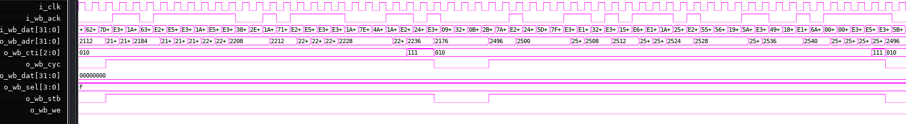
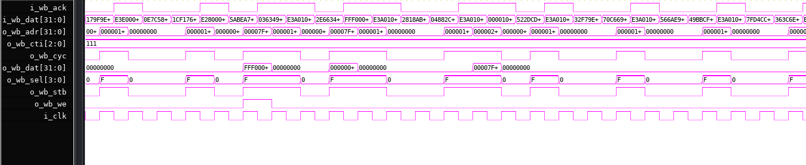
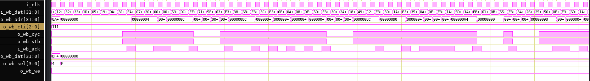

# The ZAP Processor

**By**[ **Revanth Kamaraj** ](https://github.com/krevanth)**<**[**revanth91kamaraj@gmail.com**](mailto:revanth91kamaraj@gmail.com)**>**

Copyright (C) 2016-2022 Revanth Kamaraj

This program is free software; you can redistribute it and/or modify it under the terms of the GNU General Public License as published by the Free Software Foundation; either version 3 of the License, or (at your option) any later version.

This program is distributed in the hope that it will be useful, but WITHOUT ANY WARRANTY; without even the implied warranty of MERCHANTABILITY or FITNESS FOR A PARTICULAR PURPOSE. See the GNU General Public License for more details.

You should have received a copy of the GNU General Public License along with this program; if not, write to the Free Software Foundation, Inc., 51 Franklin Street, Fifth Floor, Boston, MA 02110-1301 USA.

## 1. Introduction

The ZAP is intended to be used in FPGA projects that need a high performance application class soft processor core. Most aspects of the processor can be configured through HDL parameters.  The processor can be synthesized  with 0 slack at 166MHz on Artix-7 series SG-3 devices in the slow-slow (SS) corner. 

The default processor specification is as follows (The table below is based on default parameters):

| **Property**              | **Value**                                                                                                                                                                                                                  |
| ------------------------- | -------------------------------------------------------------------------------------------------------------------------------------------------------------------------------------------------------------------------- |
| Performance               | Synthesized at 166MHz @ xc7a75tcsg324-3 Artix-7 FPGA with 0 slack. <br/>130 DMIPS @ 166MHz with cache enabled. **Cache must be enabled, and utilized effectively, for peak performance.**                                  |
| Clock and Reset           | Purely synchronous reset scheme. Purely rising edge clock driven design.                                                                                                                                                   |
| IRQ                       | Supported. Level sensitive interrupt signal. CPU uses a dual rank synchronizer to sample this and make it synchronous to the rising edge of clock.                                                                         |
| FIQ                       | Supported. Level sensitive interrupt signal. CPU uses a dual rank synchronizer to sample this and make it synchronous to the rising edge of clock.                                                                         |
| Pipeline Depth            | 17                                                                                                                                                                                                                         |
| Issue and Execution Width | Single issue, in order, scalar core, with very limited out-of-order completion for some loads/stores that miss in cache.                                                                                                   |
| Data Width                | 32                                                                                                                                                                                                                         |
| Address Width             | 32                                                                                                                                                                                                                         |
| Virtual Address Width     | 32                                                                                                                                                                                                                         |
| Instruction Set Versions  | V5TE (1999) without FPU                                                                                                                                                                                                    |
| L1 I-Cache                | 8KB Direct Mapped VIVT Cache.<br/>64 Byte Cache Line                                                                                                                                                                       |
| L1 D-Cache                | 8KB Direct Mapped VIVT Cache<br>64 Byte Cache Line                                                                                                                                                                         |
| I-TLB Structure           | 4 x Direct mapped, one direct mapped TLB per page size. 4 entries for 1MB pages, 8 entries for 64KB pages, 16 entries for 4KB pages and 32 entries for 1KB pages. Each page size has a unique hardware buffer.             |
| D-TLB Structure           | 4 x Direct mapped, one direct mapped TLB per page size. 4 entries for 1MB pages, 8 entries for 64KB pages, 16 entries for 4KB pages and 32 entries for 1KB pages. Each page size has a unique hardware buffer.             |
| Branch Prediction         | Direct Mapped Bimodal Predictor. <br/>Direct Mapped BTB.<br>512 entries in T state (16-bit instructions).<br>256 entries in 32-bit instruction state.                                                                      |
| RAS Depth                 | 4 deep return address stack.                                                                                                                                                                                               |
| Branch latency            | 12 cycles (wrong prediction or unrecognized branch)<br>3 cycles (taken, correctly predicted)<br>1 cycle (not-taken, correctly predicted)<br>12 cycles (32-bit/16-bit switch)<br>18 cycles (Exception/Interrupt Entry/Exit) |
| Fetch Buffer              | FIFO, 16 x 32-bit.                                                                                                                                                                                                         |
| Bus Interface             | Unified 32-Bit Wishbone B3 bus with CTI and BTE signals.<br/>BTE and CTI signals are used only when cache is enabled.                                                                                                      |

##### FPGA Utilization Report for the Core + Cache + MMU:

> Note that the MMU is present inside the cache.

| Name                                 | Slice  LUTs | Slice  Registers | F7  Muxes | F8  Muxes | Block  RAM  Tile | DSPs |
| ------------------------------------ | ----------- | ---------------- | --------- | --------- | ---------------- | ---- |
| zap_top                              | 21662       | 14289            | 991       | 320       | 22.5             | 4    |
| genblk1.u_code_cache  (zap_cache)    | 4629        | 4270             | 204       | 5         | 10               | 0    |
| genblk1.u_data_cache  (zap_dcache)   | 7414        | 4617             | 165       | 25        | 10               | 0    |
| u_sync  (zap_dual_rank_synchronizer) | 0           | 4                | 0         | 0         | 0                | 0    |
| u_zap_core  (zap_core)               | 9614        | 5325             | 622       | 290       | 2.5              | 4    |
| u_zap_wb_merger  (zap_wb_merger)     | 5           | 73               | 0         | 0         | 0                | 0    |

A simplified block diagram of the ZAP pipeline is shown below. Note that ZAP is mostly a single issue scalar processor.


ZAP includes several microarchitectural enhancements to improve instruction throughput, hide external bus and memory latency and boost performance:

* The ability to continue instruction execution even when the data cache is being filled. The data cache features hit under miss capability. The processor stalls when an instruction that depends on the cache access is decoded.
* Direct mapped instruction and data caches. These caches are virtually indexed and virtually tagged. Individual caches allow code and data to be accessed at the same time. The sizes of these caches can be set during synthesis. Cache size is parameterizable. Cache line width may be set as well.
* The D-cache also stores the physical address of the cache line on write as this allows subsequent cache clean operations to avoid having to walk the page table again. This feature does increase resource usage but can significantly reduce cache clean latency.
* Direct mapped instruction and data memory TLBs. Having separate translation buffers allows data and code translation to happen in parallel. The sizes of these TLBs can be set during synthesis. Six different TLB memories are provides, each providing direct mapped buffering for sections, large page and small page, each for instruction and data (3 x 2 = 6). The sizes of these 6 memories is parameterizable.
* A 4-state bimodal branch predictor that predicts the outcome of immediate branches and branch-and-link instructions. ZAP employs a BTB (Branch Target Buffer) to predict branch outcomes early.
* A 4 deep return address stack that stores the predicted return address of branch and link instructions function return. When a `BX LR`, `MOV PC,LR` or a block load with PC in register list, the processor pops off the return address. Note that switching between A (32-bit) and T state (16-bit) has a penalty of 12 cycles.
* The ability to execute most 32-bit instructions in a single clock cycle. The only instructions that take multiple cycles include branch-and-link, 64-bit loads and stores, block loads and stores, swap instructions and `BLX/BLX2`.
* A highly efficient superpipeline with dual feedback networks to minimize pipeline stalls as much as possible while allowing for high clock frequencies. A deep 17 stage superpipelined architecture that allows the CPU to run at relatively high FPGA speeds.
* Multiplication/MAC operations takes 3 cycles per operation (+1 is result is immediately used). Note that the multiplier inside the ZAP processor is not pipelined.
* The abort model is base restored. This allows for the implementation of a demand based paging system if supporting software is available.

### 1.1. Superpipelined Microarchitecture

ZAP uses a 17 stage execution pipeline to increase the throughput of instructions to the processor. The 17 stage pipeline consists of Address Generator, TLB Check, Cache Access, Memory, Fetch, Instruction Buffer, T Decoder, Pre-Decoder, Decoder, Issue, Shift, Execute, TLB Check, Cache Access, Memory and Writeback.

> To maintain compatibility with the V5TE standard, reading the program counter (PC) will return PC + 8 when read.

During normal operation:

* One instruction is writing out one or two results to the register bank.
  * In case of `LDR`/`STR` with writeback, two results are being written to the register bank in a single cycle.
  * All other instructions write out one result to the register bank per cycle.
  * A pending load might write another value. The RF has 3 write ports.
* The instruction before that is accessing the cache/TLB RAM.
* The instruction before that is accessing the cache/TLB RAM.
* The instruction before that is accessing the cache/TLB RAM.
* The instruction before that is accessing the cache/TLB RAM.
* The instruction before that is performing arithmetic, logic or memory address generation operations. This stage also confirms or rejects the branch predictor's decisions. The ALU performs saturation in the same cycle.
* The instruction before that is performing a correction, shift or multiply/MAC operation.
* The instruction before that is performing a register or pipeline read.
* The instruction before that is being decoded.
* The instruction before that is being sequenced to micro-ops (possibly).
  * Most of the time, 1 x 32-bit instruction = 1 micro-op.
  * The only 32-bit instructions requiring more than 1 micro-op generation are `BLX, BL, LDM, STM, SWAP, LDRD, STRD, LDR loading to PC` and long multiply variants (They generate a 32-bit result per micro-op).
  * All other instructions are decode to just a single micro-op.
  * Most micro-ops can be execute in a single cycle.
  * This stage also causes branches predicted as taken to be actually executed. The latency for a successfully predicted taken branch is 3 cycles.
* The instruction before that is being being decompressed. This is only required in the T state, else the stage simply passes the instructions on.
* The instruction before that is popped off the instruction buffer.
* The instruction before that is pushed onto the instruction buffer. Branches are predicted using a bimodal predictor (if applicable).
* The instruction before that is accessing the cache/TLB RAM.
* The instruction before that is accessing the cache/TLB RAM.
* The instruction before that is accessing the cache/TLB RAM.
* The instruction before that is accessing the cache/TLB RAM.

The deep pipeline, although uses more resources, allows the ZAP to run at higher clock speeds.

#### 1.1.1. Automatic Dual Forwarding Network

The ZAP pipeline has an efficient automatic dual forwarding network with interlock detection hardware. This is done automatically and no software intervention is required. This complex feedback logic guarantees that almost all micro-ops/instructions execute at a rate of 1 every cycle.

Most of the time, the pipeline is able to process 1 instruction per clock cycle. The only times a pipeline stalls (bubbles inserted) is when (assume 100% cache hit rate and 100% branch prediction rate):

* An instruction uses a register that is a data (not pointer) destination for an `LDR`/`LDM` instruction within 7 cycles.
* Two back to back instructions that require non-zero shift and the second instruction's operand overlaps with the first instruction's destination.
* When a previous instruction modifies the flags and the current instruction requires a non-trivial shift operation. Note that `LSL #0` is considered a trivial shift operation.
* The pipeline is executing any multiply/MAC instruction:
  * Introduces a 3 cycle bubble into the pipeline if a single register is written out. (+1 if two registers are written out)
  * An instruction that uses a register that is/are destination(s) for multiply/MAC adds +1 to the multiply/MAC operation's latency.
* `B` is executed as it adds a 3 cycle bubble due to branch prediction. Takes +1 cycle if link bit is set.
* `MOV`/`ADD` instructions with `pc/r15` as destination are executed. They will insert a 3 cycle bubble in the pipeline.
* `MSR` when writing to CPSR, and changing lower three bytes. This will insert a 12 cycle bubble into the pipeline.
* `LDx` with `pc/r15` in the register list/data register is executed. This will insert a 9 cycle bubble in the pipeline.
* `MCR`/`MRC` / `SWI` are executed. These will insert an 18 cycle bubble into the pipeline.
* `CLZ` and saturating arithmetic(`QADD`/`QSUB`/`QDADD`/`QDSUB`) operations take 4 clock cycles per instruction.

This snippet of 32-bit instruction code takes 6 cycles to execute:

```
    ADD  R1, R2, R2 LSL #10 (1 cycle)
    ADD  R1, R1, R1 LSL #20 (2 cycles)
    ADD  R3, R4, R5, LSR #3 (1 cycle)
    ADD  R3, R3, R3         (1 cycle)
    MOV  R4, R3             (1 cycle)
```

This snippet of 32-bit instruction code takes only 5 cycles (Possible because of dual feedback network):

```
    ADD  R1, R2, R2, R2     (1 cycle)
    ADD  R1, R1, R1 LSL #2  (1 cycle)
    ADD  R3, R4, R5 LSR #3  (1 cycle)
    ADD  R3, R3, R3         (1 cycle)
    MOV  R4, R3             (1 cycle)
```

#### 1.1.2. Single Cycle Load with Writeback

The ZAP can execute `LDR`/`STR` with writeback in a single cycle. It will perform a parallel write to the register file with the pointer register and the data register in the same cycle.

#### 1.1.3. Hit Under Miss/Execute Under Miss

Data cache accesses that are performing line fills will not block subsequent instructions from executing. In addition, the data cache supports hit under miss functionality i.e., the cache can service the next memory access (hit) while handing the current line fill (miss). Thus, the ZAP can change the order of completion of memory accesses with respect to other instructions, when possible, in a relatively simple way.

If a store misses and is in the process of a line fill, a subsequent load at the same address will report as a hit during the line fill.

Some examples are shown below.

The unoptimized code below takes 15 cycles due to improperly optimized load latency (The code still works fine):

```
LDR R1, [R2]
// Load latency since value is used immediately = 7 cycles
ADD R3, R2, R1 
ADD R4, R4, R5
ADD R5, R8, R7
ADD R12, R4, R5
ADD R13, R8, R7
ADD R11, R4, R5
ADD R10, R8, R7
ADD R10, R10, R11
```

This can be reduced to 9 cycles by reordering the code:

```
LDR R1, [R2]
// Load latency is hidden.
ADD R4, R4, R5
ADD R5, R8, R7
ADD R12, R4, R5
ADD R13, R8, R7
ADD R11, R4, R5
ADD R10, R8, R7
ADD R10, R10, R11
ADD R3, R2, R1 
```

#### 1.1.4. Multi Port Register File

ZAP implements the register file in flip-flops. The register file provides 4 read ports and 3 write ports (A, B and C). The operation is as follows:

| Operation           | Port A | Port B | Port C                               |
| ------------------- | ------ | ------ | ------------------------------------ |
| Load with Writeback | Used   | Used   | _Free to be used by background load_ |
| Other               | Used   | Unused | _Free to be used by background load_ |

#### 1.1.5. Branch Predictor and Return Address Stack

To improve performance, the ZAP processor uses a bimodal branch predictor. A branch memory is maintained which stores the state of each branch and the target address and branch tag. Note that the predictor can only predict the listed 32-bit instructions (and equivalent 16-bit instructions in T state):

`Bcc[L]`

`BX LR` that does not switch 32/16-bit instruction state.

`ADD`/`MOV` instruction with destination as PC.

`LDM` with PC in register list

`LDR` that loads to PC.

`MOV PC, LR`

instructions. Some of these utilize the RAS for better prediction. Using an unlisted instruction to branch will result in 12 cycles of penalty.

The processor implements a 4 deep return address stack. The RAS and the predictor cannot be disabled. They are transparent to software and self clearing if they predict a non branch instruction as a branch.

Upon calls to

* `BL offset`

the potential return address is pushed to a stack in the processor.

On encountering these 32-bit instructions (or equivalent 16-bit instructions):

* `BX LR`,
* `MOV PC, LR`
* `LDM` with PC in register list.
* `LDR` to PC with SP as base address register.

the CPU treats them as function returns and will pop return address of the stack much earlier.

This results in some performance improvement and reduced branch latency. Correctly predicted return takes 2 cycles (first two in the above list) or 9 cycles(last two in the above list), while incorrectly or unpredicted returns takes 12 cycles.

Returns that result in change from 32 to 16-bit instruction state or vice versa are unpredicted, and take 12 cycles. Performance optimization of returns is available only when no instruction set state change occurs i.e., for faster returns: 32-bit instruction code should return to 32-bit instruction code, 16-bit instruction code should return to 16-bit instruction code.

### 1.2. Wishbone Bus Interface

ZAP features a common 32-bit Wishbone B3 bus to access external resources (like DRAM/SRAM/IO etc). The processor can generate byte, halfword or word accesses. The processor uses CTI and BTE for efficient bus transfers. Note that multiprocessing is not readily supported and hence, `SWAP/SWAPB` instructions do not **actually** perform locked transfers.

The 32-bit standard Wishbone bus makes it easy to interface to other components over a typical 32-bit FPGA SoC bus, without the need for up/down converters. A future enhancement may be to add wider busses.

ZAP can issue three kinds of transactions:

- Wishbone BURST Cycles.

- Wishbone CLASSIC Cycles.

- Wishbone BLOCK Cycles.

They are described below.

#### 1.2.1. CPU with Cache and MMU (ONLY_CORE=0x0)

##### 1.2.1.1. *Cache Maintenance Operations*

> The recommended way to transfer data to MMIO peripherals is through DMA. The cache can be cleaned by loading an address that maps to the same block. Then, a DMA transfer can be setup from the newly written back memory to the peripheral.

- When **ONLY_CORE=0x0**, the following operations will result exclusively in Wishbone **BURST** cycles:
  
  - Cache line writeback to memory.
  
  - Cache line download from memory.

- Caches offer a huge performance benefit, and allow instruction and data streams to be accessed in parallel, and quickly.

- Cache must be enabled as soon as possible for good performance.

- The CTI signal indicates this operation by indicating 0x010 for the burst, and 0x111 for the EOB (end-of-burst).

- The diagram below shows 16 x 4 byte = 64 bytes of memory being fetched for a cache linefill.



- The diagram below shows 16 x 4 byte = 64 bytes of cache (1 cacheline) being written back to memory. 


##### 1.2.1.2. *Uncacheable Operations*

Software must try to minimize the occurrence of uncacheable operations in performance critical code (See MMIO note in section 1.2.1.1).

When **ONLY_CORE = 0x0**, the following types of accesses can result in mostly Wishbone **CLASSIC** cycles. Note that few transfers may still be issued as **BLOCK** transfers occasionally.

- Access to uncacheable regions.

- Cache is turned OFF.

- MMU page table walk.



#### 1.2.2. Cache-less and MMU-less Configuration (ONLY_CORE = 0x1)

- When **ONLY_CORE=0x1**, the CPU is synthesized without a cache and MMU. 

- This mode exclusively generates Wishbone **BLOCK** cycles.  

- The external bus latency for CLASSIC/BLOCK cycles it typically higher than burst cycles, because block cycles do not provide a hint if the next address is consecutive or not. 

- ZAP will freely intermix instruction and data accesses within BLOCK cycles. 

- The processor can issue a BLOCK Wishbone access every cycle.



### 1.3. System Control

Please refer to the v5TE specification for CP15 CSR architectural requirements. The ZAP implements the following software accessible registers within its CP15 coprocessor.  

> `MCR/MRC/LDC/STC` act as fence instructions, and ensure all instructions before them have executed before executing.

#### 1.3.1. Register 0: **ID Code Register (Opcode2 = 0x0).**

| Bit   | Meaning      |
| ----- | ------------ |
| 3:0   | RAZ          |
| 15:4  | Reads 0xAAAA |
| 19:16 | Reads 0x5    |
| 23:20 | RAZ          |
| 31:24 | RAZ          |

#### 1.3.2. Register 0: **CTPYE Register (Opcode2 = 0x1).**

| Bit   | Meaning                                                                                                                                                                                                                             |
| ----- | ----------------------------------------------------------------------------------------------------------------------------------------------------------------------------------------------------------------------------------- |
| 11:0  | Reads out instruction cache size and other info.<br/>1:0 = Cache is 2^LEN + 1 words wide<br/>2 = M bit. Reads 0x0.<br/>5:3 = Reads 0x0 for direct mapped.<br/>8:6 = Cache is 2^SIZE KB<br/>When **ONLY_CORE=0x1**, bit 2 reads 0x1. |
| 23:12 | Reads out instruction cache size and other info.<br/>1:0 = Cache is 2^LEN + 1 words wide<br/>2 = M bit. Reads 0x0.<br/>5:3 = Reads 0x0 for direct mapped.<br/>8:6 = Cache is 2^SIZE KB<br/>When **ONLY_CORE=0x1**, bit 2 reads 0x1. |
| 24    | RAO. Separate I/D caches.                                                                                                                                                                                                           |
| 28:25 | The CTYPE field. Reads out 0x1.                                                                                                                                                                                                     |

#### 1.3.3. Register 1: **Cache and MMU control.**

| Bit | Meaning                                                                                          |
| --- | ------------------------------------------------------------------------------------------------ |
| 0   | 0x1: MMU Enable<br/>0x0: MMU Disable<br/>When **ONLY_CORE=0x1**, this bit always reads 0.        |
| 1   | RO, RAZ. 0x0: Alignment fault never checked.                                                     |
| 2   | 0x1: DCache Enable<br/>0x0: DCache Disable<br/>When **ONLY_CORE=0x1**, this bit always reads 0.  |
| 3   | RAZ. No write buffer.                                                                            |
| 4   | RAO. No 26-bit compatibility.                                                                    |
| 5   | RAO. No 26-bit compatibility.                                                                    |
| 6   | RAO. Base updated abort model. ZAP only supports the base updated restore model.                 |
| 7   | Big Endian Enable. Reflects BE_32_ENABLE parameter. RO.                                          |
| 8   | S Bit. Used by the ZAP MMU. Has an impact only when **ONLY_CORE=0x0**.                           |
| 9   | R Bit. Used by the ZAP MMU. Has an impact only when **ONLY_CORE=0x0**.                           |
| 10  | RESERVED                                                                                         |
| 11  | RAO. Branch predictor enabled. Always enabled.                                                   |
| 12  | 0x1: ICache Enable.<br/>0x0: ICache Disable<br/>When **ONLY_CORE=0x1**, this bit always reads 0. |
| 13  | RAZ. Normal exception vectors.                                                                   |
| 14  | RAO. Predictive direct mapped strategy.                                                          |
| 15  | 0x0: Compressed instruction support is v5T.<br/>0x1: Compressed instruction support is v4T.      |

#### 1.3.4. Register 2: **Translation Base.**

Provide a 16KB aligned translation base address here.

| Bit   | Meaning                |
| ----- | ---------------------- |
| 31:14 | Translation Table Base |
| 13:0  | RESERVED               |

#### 1.3.5. Register 3: **Domain Access Control**.

| Bit     | Meaning  |
| ------- | -------- |
| 2k+1:2k | DAC bits |

#### 1.3.6. Register 5: **FSR.**

| Bit  | Meaning                                                                                                                                                                                                                               |
| ---- | ------------------------------------------------------------------------------------------------------------------------------------------------------------------------------------------------------------------------------------- |
| 3:0  | Status bits. <br/>Supported faults: L1 External Abort on Translation, L2 External Abort on Translation, Terminal Exception, Translation, Domain or Permission Fault. Terminal abort is signaled when uncacheable accesses fail. <br/> |
| 7:4  | Domain                                                                                                                                                                                                                                |
| 8    | RAZ                                                                                                                                                                                                                                   |
| 31:9 | --                                                                                                                                                                                                                                    |

#### 1.3.7. Register 6: **FAR**.

| Bit  | Meaning                |
| ---- | ---------------------- |
| 31:0 | Fault Address Register |

#### 1.3.8. Register 8: **TLB functions**.

| TLB Operation    | Opcode2 | CRM    |
| ---------------- | ------- | ------ |
| Invalidate TLB   | 0b00x   | 0b0111 |
| Invalidate I-TLB | 0b00x   | 0b0101 |
| Invalidate D-TLB | 0b00x   | 0b0110 |

#### 1.3.9. Register 7: **Cache functions**.

- The arch spec allows for a subset of the functions to be implemented for register 7. 
- These below are valid value supported in ZAP for register 7. Using other operations will result in UNDEFINED operation.
- A more efficient way to clean the cache is to load another block into it. Since ZAP offers direct mapped caches, this can easily be done. In fact, triggering loading a new block into cache (using an `LDR`) is the recommended way to clean the cache.

| Cache Operation                                      | Opcode2 | CRM    |
| ---------------------------------------------------- | ------- | ------ |
| Flush instruction and data cache                     | 0b000   | 0b0111 |
| Flush instruction cache                              | 0b000   | 0b0101 |
| Flush data cache                                     | 0b000   | 0b0110 |
| Clean data cache                                     | 0b000   | 0b101x |
| Clean and flush data cache. Flush instruction cache. | 0b000   | 0b1111 |
| Clean and flush data cache                           | 0b000   | 0b1110 |

#### 1.3.10. Register 13: **FCSE Register.**

| Bit   | Meaning  |
| ----- | -------- |
| 31:25 | PID      |
| 24:0  | RESERVED |

### 1.4. Implementation Options

ZAP implements the integer instruction set specified in the v5TE specification. T refers to the 16-bit instruction set and E refers to the enhanced DSP extensions. ZAP does not implement the optional floating point extension specified in Part C of v5TE specification.

#### 1.4.1. Big and Little Endian

ZAP supports little endian byte ordering or BE-32 big endian byte ordering. The endianness is fixed by a parameter. The appropriate bit in CP15 that indicates endianness is read-only, and reflects the parameter set during synthesis.

#### 1.4.2. 26-Bit Architecture

ZAP does not support the legacy 26-bit mode.

#### 1.4.3. 16-bit Compressed Support

ZAP has support for the 16-bit V5T compressed instruction set. A backward compatibility bit is available in CP15 register 1 to set the compressed instruction set version to v4T. This is in accordance with the architecture specification.

#### 1.4.4. DSP Enhanced Instruction Set

The ZAP implements the DSP-enhanced instruction set (V5E). There are new multiply instructions that operate on 16-bit data values and new saturation instructions. Some of the new instructions are:

* `SMLAxy` 32<=16x16+32
* `SMLAWy` 32<=32x16+32
* `SMLALxy` 64<=16x16+64
* `SMULxy` 32<=16x16
* `SMULWy` 32<=32x16
* `QADD` adds two registers and saturates the result if an overflow occurred.
* `QDADD` doubles and saturates one of the input registers then add and saturate.
* `QSUB` subtracts two registers and saturates the result if an overflow occurred.
* `QDSUB` doubles and saturates one of the input registers then subtract and saturate.

**NOTE:** All of the multiplication and MAC operations in ZAP take a fixed 3 clock cycles (irrespective of 32x32=32, 32x32=64, 16x16+32 etc). Additional latency of 1 cycle is incurred if the result is required in the immediate next instruction. A further additional latency of 1 cycle is incurred if two registers must be updated (long multiply/MAC operations).

The ZAP also implements `LDRD`, `STRD` and `PLD` instructions with the following implementation notes:

* `PLD` is interpreted as a `NOP`.
* `MCRR` and `MRRC` are not intended to be used on coprocessor 15 (see v5TE specification). Since ZAP does not have an external coprocessor bus, these instructions should not be used.

#### 1.4.5. Base Register Update

If a data abort is signaled on a memory instruction that specifies writeback, the contents of the base register will not be updated. This holds for all load and store instructions. This behavior is referred to in the V5TE spec as the Base Restored Abort Model.

#### 1.4.6. Cache and TLB Lockdown

ZAP does not support lockdown of cache and TLB entries.

#### 1.4.7. TLB Flush

ZAP implements global TLB flushing. If software tries to invalidate selective TLB entries, the entire TLB will be invalidated. This behavior is acceptable as per the architecture specification.

#### 1.4.8. Cache Clean and Flush

ZAP implements global cache cleaning and flushing. Cleaning and/or flushing specific cache lines/VA is not supported.

#### 1.4.9. Cache and TLB Structure

ZAP implements a direct mapped cache and TLB. Separate caches and TLBs exist for instruction and data paths. Each MMU (I and D) has 4 TLBs, one each for sections, large pages, small pages and tiny pages. Each one is direct mapped.

Thus, each cache uses 2 block RAMs (Tag and Data) and each MMU uses 4 RAMs. Functionally, the processor's memory subsystem requires 12 block RAMs. In practice, FPGA synthesis implements this using groups of smaller block RAMs (same overall function) so the BRAM count would be higher.

#### 1.4.10. FCSE

ZAP implements the FCSE.

#### 1.4.11. Cache/MMU Enabling

ZAP allows the cache and MMU to have these combinations:

| MMU | Cache | Behavior                                                   |
| --- | ----- | ---------------------------------------------------------- |
| ON  | OFF   | All pages are treated as uncacheable. C bit is IGNORED.    |
| ON  | ON    | **Caching and paging enabled. Recommended configuration.** |
| OFF | OFF   | VA = PA. All addresses are treated as uncacheable.         |
| OFF | ON    | INVALID CONFIGURATION.                                     |

#### 1.4.12. Coprocessor Interface

ZAP internally implements an internal CP15 coprocessor using its internal bus mechanism. The coprocessor interface is internal to the ZAP processor and is not exposed. Thus, ZAP only has access to its internal coprocessor 15. External coprocessors cannot be attached to the processor.

### 1.5. Implementation Specific Behaviors

The V5TE specification leaves several behaviors of the ISA to be UNPREDICTABLE. Listed below are the implementation specific behaviors of ZAP:

Using `r15/pc` as a pointer register for `STR/STM` will result in it reading as 8 bytes ahead. 

Any use of `r15/pc` in the instruction as an operand will result in it reading 8 bytes ahead.

Specifying an empty register list for multi-register load and store operations will result in no registers being actually transferred.

Attempting to context restore from `USR/SYS` mode will result in the critical bits (Mode, I, F, T) of the `cpsr` being unchanged, ensuring security.

Specifying the base register to overlap with the transfer list in multi-register load/store operations will behave as expected, with the older value of the register getting transferred.

Encoding `STRH` with bit 6 set as 1 will result in an `STR` being performed. 

Encoding `LDRH/STRH/LDRSB/STRSB` with bits 6:5 set to 0x0 will result in a normal `LDR/STR` from occurring. 

Accessing unaligned `LDRH/STRH` will cause the processor to ignore bit 0 for the memory access. Data will not be rotated. 

Accessing unaligned `LDR` will cause the 32-bit data read at the aligned address to be rotated right. For `STR`, the lower 2-bits of the address are treated as 0x0 for the memory access.

Implementation specific parts of the page table are UNUSED.

External aborts on uncacheable accesses (MMIO) will result in a TERMINAL ABORT.

### 1.6. External Aborts

ZAP provides an external abort pin `I_WB_ERR`, but it must be used with great care. In particular, the following scenarios should be carefully considered.

- Cacheable memory accesses that are validated by the TLB cannot be externally aborted. This applies to cache cleaning operations as well.

### 1.7. Multiprocessing

Because `SWAP` and `SWAPB` do not lock the bus during their individual memory accesses, ZAP cannot be used in a multiprocessing system that requires semaphores.

### 1.8. Performance

For the performance numbers below:

- The bus latency is assumed to be X cycles if the next address is not indicated beforehand (classic/block). 

- Else, the bus latency is assumed 1 cycle if the next address is known before hand (burst). Note that X cycles of initial latency is still assumed for the burst as well.

| Access Type                                      | ONLY_CORE | Total Cycles (ONLY_CORE=0x0) | Total Cycles (ONLY_CORE=0x1)                  | Cache Benefit Threshold |
| ------------------------------------------------ | --------- | ---------------------------- | --------------------------------------------- | ----------------------- |
| `LDM/STM` of 16 registers. (Cache hit)           | 0x0       | 16                           | N/A. Direct bus access will take 16*X cycles. | Always                  |
| `LDM/STM` of 16 registers. (Cache Miss)          | 0x0       | X + 34                       | N/A. Direct bus access will take16*X cycles.  | X > 2                   |
| `LDM/STM` of 16 registers (Cache Miss, Replace)  | 0x0       | 2*X + 52                     | N/A. Direct bus access will take 16*X cycles. | X > 3                   |
| `LDM/STM` of 16 registers to uncacheable region. | 0x0       | 112*X                        | 16*X cycles.                                  | Never                   |

## System Integration

### 2.1. Parameters

Note that all parameters should be 2^n. Cache size should be multiple of line size and at least 16 x line width. Caches/TLBs consume majority of the resources so should be tuned as required. The default parameters give you quite large caches. 

| Parameter                   | Default                            | Description                                                                               |
| --------------------------- | ---------------------------------- | ----------------------------------------------------------------------------------------- |
| CP15_L4_DEFAULT             | 0                                  | When 1, the 16bit ISA is compliant with V4T, right out of reset.                          |
| ONLY\_CORE                  | 0                                  | When 1, the core is stripped of the cache/MMU. When 0, the core comes with cache and MMU. |
| RESET_VECTOR                | 0                                  | Initial PC out of reset. Often, it is OK to leave it with the default value.              |
| CPSR_INIT                   | {24'd0, 1'd1, 1'd, 1'd0, 5'b10011} | Initial CPSR out of reset. Often, it is OK to leave it with the default value.            |
| BE\_32\_ENABLE              | 0                                  | Enable BE-32 Big Endian Mode. Active high. Applies to I and D fetches.                    |
| BP\_ENTRIES                 | 512                                | Predictor RAM depth. Each RAM row also contains the branch target address.                |
| FIFO\_DEPTH                 | 16                                 | Command FIFO depth.                                                                       |
| DATA\_SECTION\_TLB\_ENTRIES | 4                                  | Section TLB entries (Data).                                                               |
| DATA\_LPAGE\_TLB\_ENTRIES   | 8                                  | Large page TLB entries (Data).                                                            |
| DATA\_SPAGE\_TLB\_ENTRIES   | 16                                 | Small page TLB entries (Data).                                                            |
| DATA\_FPAGE\_TLB\_ENTRIES   | 32                                 | Tiny page TLB entries (Data).                                                             |
| DATA\_CACHE\_SIZE           | 8192                               | Cache size in bytes. Should be at least 16 x line size. Cannot exceed 64KB.               |
| CODE\_SECTION\_TLB\_ENTRIES | 4                                  | Section TLB entries.                                                                      |
| CODE\_LPAGE\_TLB\_ENTRIES   | 8                                  | Large page TLB entries.                                                                   |
| CODE\_SPAGE\_TLB\_ENTRIES   | 16                                 | Small page TLB entries.                                                                   |
| CODE\_FPAGE\_TLB\_ENTRIES   | 32                                 | Tiny page TLB entries.                                                                    |
| CODE\_CACHE\_SIZE           | 8192                               | Cache size in bytes. Should be at least 16 x line size. Cannot exceed 64KB.               |
| DATA\_CACHE\_LINE           | 64                                 | Cache Line for Data (Byte). Keep > 8                                                      |
| CODE\_CACHE\_LINE           | 64                                 | Cache Line for Code (Byte). Keep > 8                                                      |
| RAS\_DEPTH                  | 4                                  | Depth of Return Address Stack                                                             |

### 2.2. IO

**NOTE: The CPU does not support EXTERNAL aborts.**

| Port             | Description                                                                                                                                                                                                                                                                                                                                                                                                                                                                                                                                              |
| ---------------- | -------------------------------------------------------------------------------------------------------------------------------------------------------------------------------------------------------------------------------------------------------------------------------------------------------------------------------------------------------------------------------------------------------------------------------------------------------------------------------------------------------------------------------------------------------- |
| i\_clk           | Clock. All logic is clocked on the rising edge of this signal. The CPU is a fully synchronous device.                                                                                                                                                                                                                                                                                                                                                                                                                                                    |
| i\_reset         | Active high global reset signal. Fully synchronous.  The assertion and deassertion of this reset must be synchronous to the clock's rising edge. <br/>**RECOMMENDATION**: This should be directly driven from a flip-flop, placed close to the processor.                                                                                                                                                                                                                                                                                                |
| i\_irq           | Interrupt. Level Sensitive. Signal is internally synced by a dual rank synchronizer. The output of the synchronizer is considered as the single source of truth of the IRQ.                                                                                                                                                                                                                                                                                                                                                                              |
| i\_fiq           | Fast Interrupt. Level Sensitive. Signal is internally synced by a dual rank synchronizer. The output of the synchronizer is considered as the single source of truth of the FIQ.                                                                                                                                                                                                                                                                                                                                                                         |
| o\_wb\_cyc       | Wishbone CYC signal. The processor always drives CYC and STB together.                                                                                                                                                                                                                                                                                                                                                                                                                                                                                   |
| o\_wb\_stb       | Wishbone STB signal. The processor always drives CYC and STB together.                                                                                                                                                                                                                                                                                                                                                                                                                                                                                   |
| o\_wb\_adr[31:0] | Wishbone address signal. The lower 2-bits are always driven to 0x0.                                                                                                                                                                                                                                                                                                                                                                                                                                                                                      |
| o\_wb\_we        | Wishbone write enable signal.                                                                                                                                                                                                                                                                                                                                                                                                                                                                                                                            |
| o\_wb\_dat[31:0] | Wishbone data output signal.                                                                                                                                                                                                                                                                                                                                                                                                                                                                                                                             |
| o\_wb\_sel[3:0]  | Wishbone byte select signal.                                                                                                                                                                                                                                                                                                                                                                                                                                                                                                                             |
| o\_wb\_cti[2:0]  | Wishbone CTI (Incrementing Burst and EOB are supported)                                                                                                                                                                                                                                                                                                                                                                                                                                                                                                  |
| o\_wb\_bte[1:0]  | Wishbone BTE (Always reads "linear" i.e., 0x0)                                                                                                                                                                                                                                                                                                                                                                                                                                                                                                           |
| i\_wb\_ack       | Wishbone acknowledge signal. <br/>**RECOMMENDATION**: This should come from a flip-flop placed close to the processor.                                                                                                                                                                                                                                                                                                                                                                                                                                   |
| i_wb_err         | Wishbone error signal. The system should never flag an abort on cacheable memory regions validated by the page tables. <br/>**RECOMMENDATION:** This should come from a flip-flop placed closed to the processor.                                                                                                                                                                                                                                                                                                                                        |
| i\_wb\_dat[31:0] | Wishbone data input signal. <br/>**RECOMMENDATION**: This should come from a register placed close to the processor.                                                                                                                                                                                                                                                                                                                                                                                                                                     |
| o_trace[1023:0]  | Generates trace information over a 1024-bit bus. This signal is only intended for DV and is meant to be used only in simulation.<br/>The format of the trace string is as follows:<br/>PC_ADDRESS:\<INSTRUCTION\> WA1\@WDATA2 WA2\@WDATA2 CPSR<br/>(or)<br/>PC_ADDRESS:\<INSTRUCTION\>\* for an instruction whose condition code failed.<br/>If an exception is taken, the words, DABT, FIQ, IRQ, IABT, SWI and UND are display in place of the above formats. Out of reset, RESET is shown.<br/>When DEBUG_EN is not defined, this port is not defined. |
| o_trace_valid    | Sample trace information when this signal is 1. This signal is only intended for DV and is meant to be used only in simulation. The signal is not available when DEBUG_EN is not defined.                                                                                                                                                                                                                                                                                                                                                                |
| o_trace_uop_last | Used to identify a uop end boundary. This signal is intended only for DV and is meant to be used only in simulation. This signal is not available when DEBUG_EN is not defined.                                                                                                                                                                                                                                                                                                                                                                          |

### 2.3. Integration

* To use the ZAP processor in your project:
  
  * Get the project files:
    
    > `git clone https://github.com/krevanth/ZAP.git`
  
  * Add all the files in `src/rtl/*.sv` to your project.
  
  * Add `src/rtl/` to your tool's search path to allow it to pick up SV headers.
  
  * Instantiate the ZAP processor in your project using this template:

```
       zap_top #(.CP15_L4_DEFAULT         (),
                 .BE_32_ENABLE            (),
                 .CPSR_INIT               (),
                 .RESET_VECTOR            (),
                 .FIFO_DEPTH              (),
                 .BP_ENTRIES              (),
                 .DATA_SECTION_TLB_ENTRIES(),
                 .DATA_LPAGE_TLB_ENTRIES  (),
                 .DATA_SPAGE_TLB_ENTRIES  (),
                 .DATA_FPAGE_TLB_ENTRIES  (),
                 .DATA_CACHE_SIZE         (),
                 .CODE_SECTION_TLB_ENTRIES(),
                 .CODE_LPAGE_TLB_ENTRIES  (),
                 .CODE_SPAGE_TLB_ENTRIES  (),
                 .CODE_FPAGE_TLB_ENTRIES  (),
                 .CODE_CACHE_SIZE         ()) u_zap_top (
                 .i_clk                   (),
                 .i_reset                 (),
                 .i_irq                   (),
                 .i_fiq                   (),
                 .o_wb_cyc                (),
                 .o_wb_stb                (),
                 .o_wb_adr                (),
                 .o_wb_we                 (),
                 .o_wb_cti                (),
                 .i_wb_dat                (),
                 .o_wb_dat                (),
                 .i_wb_ack                (),
                 .i_wb_err                (),
                 .o_wb_sel                (),
                 .o_wb_bte                ()
       );
```

* The processor provides a Wishbone B3 bus. It is recommended that you use it in registered feedback cycle mode.
* Interrupts are level sensitive and are internally synced to clock.

## 3. Project Environment

The recommended project environment requires Docker to be installed at your site. Click [here](https://docs.docker.com/engine/install/) for instructions on how to install Docker. The steps here assume that the user is a part of the `docker` group.

If your site has the latest EDA tools and other tools required (Verilator, GTKWave, GCC Cross Compiler, Xterm, Make, Perl, Bash, Cargo) installed, and if you do not wish to use Docker, then you should not pass the `DOCKER=1` argument when invoking `make`, hence the argument is shown as optional in the examples below.  The `SEED` arguments allows passing of specific seed and enabling waveform logging. When switching from passing no seed to passing a seed, please run the `clean` make target first. 

### 3.1. Running TCs

To run all/a specific TC, do:

> `make [DOCKER=1] [XTERM=1] [SEED=<Seed>] [TC=test_name]`

See `src/ts` for a list of test names. Not providing a test name will run all tests.

If `XTERM=1` is passed to `make`, the test will fork an XTERM window (per TC). The window will auto close on success, but will remain open with an error message on failure. In this mode, the TCs are executed in parallel.

Else, the TC will run on the command line. In this mode, the TCs are executed sequentially.

To remove existing object/simulation/synthesis files, do:

> `make [DOCKER=1] clean`

### 3.2. Adding TCs

* Create a folder `src/ts/<test_name>`

* Please note that these will be run on the sample TB SOC platform.
  
  * See `src/testbench/testbench.v` for more information.

* Tests will produce wave files in the `obj/src/ts/<test_name>/zap.vcd`.

* Add a C file (.c), an assembly file (.s) and a linker script (.ld).

* Create a `Config.cfg`. This is a Perl hash that must be edited to meet requirements. Note that the registers in the `REG_CHECK` are indexed registers. To find those, please do:
  
  > `cat src/rtl/zap_localparams.svh | grep PHY`
  
  For example, if a check requires a certain value of R13 in IRQ mode, the hash will mention the register number as r25.

* Here is a sample `Config.cfg`:

```
       %Config = ( 
               # CPU configuration. Currently, testbench only supports LE and V4T..
               DATA_CACHE_SIZE             => 4096,    
               CODE_CACHE_SIZE             => 4096,    
               CODE_SECTION_TLB_ENTRIES    => 8,       
               CODE_SPAGE_TLB_ENTRIES      => 32,      
               CODE_LPAGE_TLB_ENTRIES      => 16,      
               DATA_SECTION_TLB_ENTRIES    => 8,       
               DATA_SPAGE_TLB_ENTRIES      => 32,      
               DATA_LPAGE_TLB_ENTRIES      => 16,      
               BP_DEPTH                    => 1024,    
               INSTR_FIFO_DEPTH            => 4,       


               # Testbench configuration.
               MAX_CLOCK_CYCLES            => 100000,  
                                              # Clock cycles to run the 
                                              # simulation for.

               REG_CHECK                   => {"r1" => "32'h4", 
                                               "r2" => "32'd3"},      
                                              # Make this an anonymous has with 
                                              # entries like "r10" => "32'h0". 

               FINAL_CHECK                 => {"32'h100" => "32'd4", 
                                               "32'h104" => "32'h12345678",
                                               "32'h66" =>  "32'h4"}   
                                              # Make this an anonymous hash
                                              # with entries like 
                                              # Base address of 32-bit word => 
                                              # 32-bit verilog_value. The 
                                              # script compares 4 bytes at 
                                              # once.
        );
```

### 3.3. Running RTL Lint

To run RTL lint with Verilator, simply do:

> `make [DOCKER=1] lint`

To run RTL lint with svlint (no Docker support, install with `cargo install svlint`):

> `make svlint`

### 3.4. Running Xilinx Vivado Synthesis

**IMPORTANT NOTE: Do NOT define DEBUG_EN when performig synthesis.**

Synthesis scripts can be found here: `src/syn/`

Assuming you have Vivado installed, please do (in project root directory):

> `make syn`

Timing report will be available in `obj/syn/syn_timing.rpt`

#### 3.4.1. XDC Setup (Vivado FPGA Synthesis)

* The XDC assumes a 170MHz clock for an Artix 7 FPGA part with -3 speed grade.
* All inputs are given an input delay of 1ns, typical for an FPGA flip-flop.
* Outputs assume they are driving flip-flops with Tsu = 2ns Th=1ns.

## 4. Acknowledgements

Thanks to [Erez Binyamin](https://github.com/ErezBinyamin) for adding Docker infrastructure support.

Thanks to [ElectronAsh](https://github.com/electronash/sim_3do) for working on a 3DO video game project based around the ZAP core.

Thanks to [Bharath Mulagondla](https://github.com/bharathmulagondla) and [Akhil Raj Baranwal](https://github.com/arbaranwal) for pointing out bugs in the design.

The testbench UART core in `src/testbench/uart.v` is based on the [UART-16550 core](https://github.com/freecores/uart16550) project.

Testbench assembly code in `src/ts/mode32_test*/` is based on Jonathan Masur's and Xavier Jimenez's work that can be found [here](https://opencores.org/users/Bregalad/profile)

Testbench assembly code in `src/ts/mode16_test*/` is based on Julian Smolka's work [here](https://github.com/jsmolka/gba-tests)

## 5. License

Copyright (C) 2016-2022 Revanth Kamaraj

This program is free software; you can redistribute it and/or modify it under the terms of the GNU General Public License as published by the Free Software Foundation; either version 3 of the License, or (at your option) any later version.

This program is distributed in the hope that it will be useful, but WITHOUT ANY WARRANTY; without even the implied warranty of MERCHANTABILITY or FITNESS FOR A PARTICULAR PURPOSE. See the GNU General Public License for more details.

You should have received a copy of the GNU General Public License along with this program; if not, write to the Free Software Foundation, Inc., 51 Franklin Street, Fifth Floor, Boston, MA 02110-1301 USA.

## 
